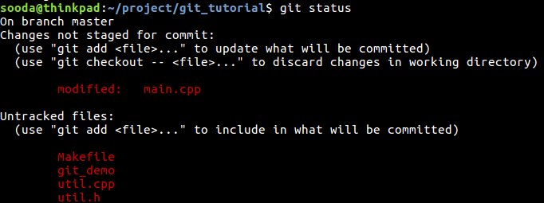
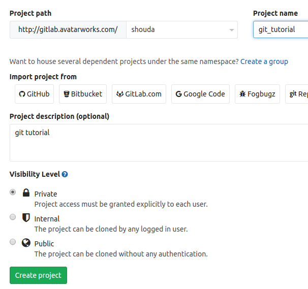
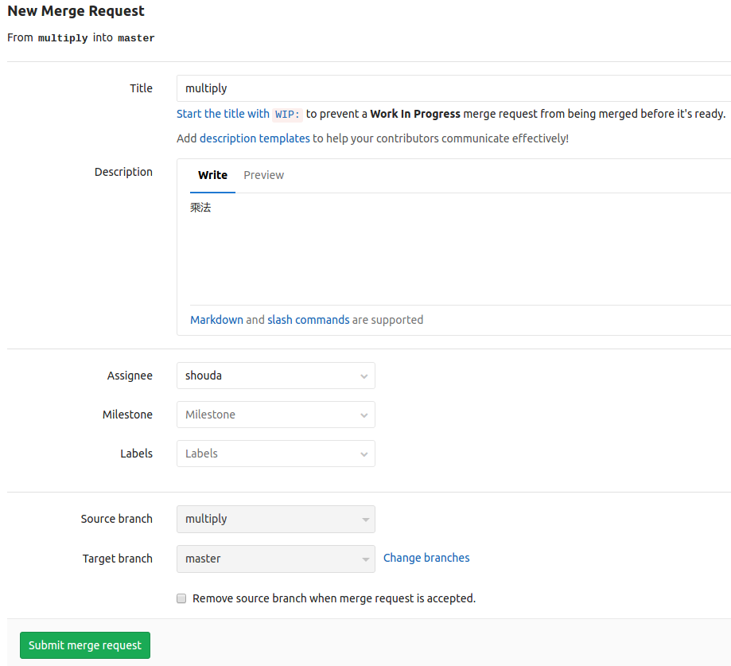
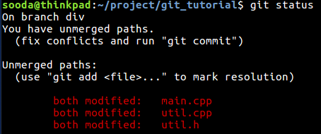
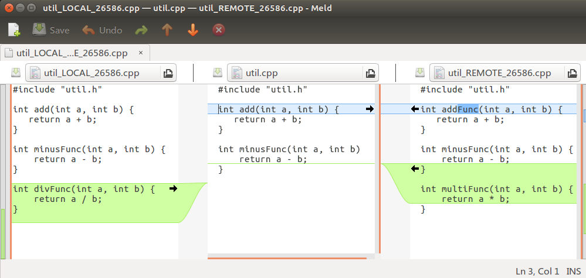
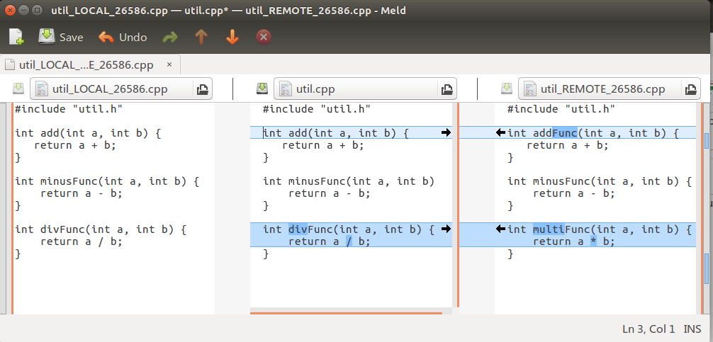
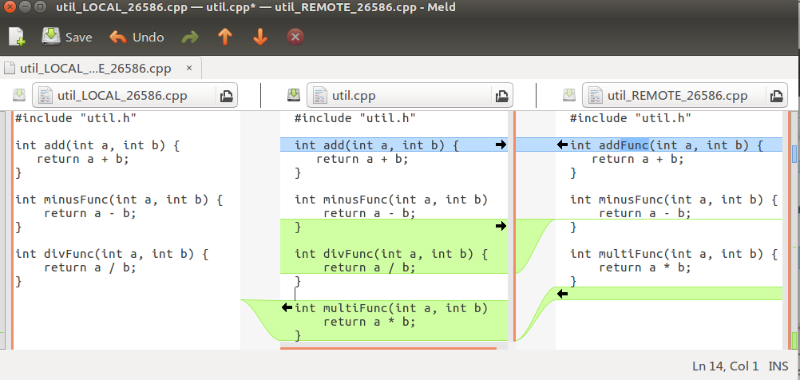
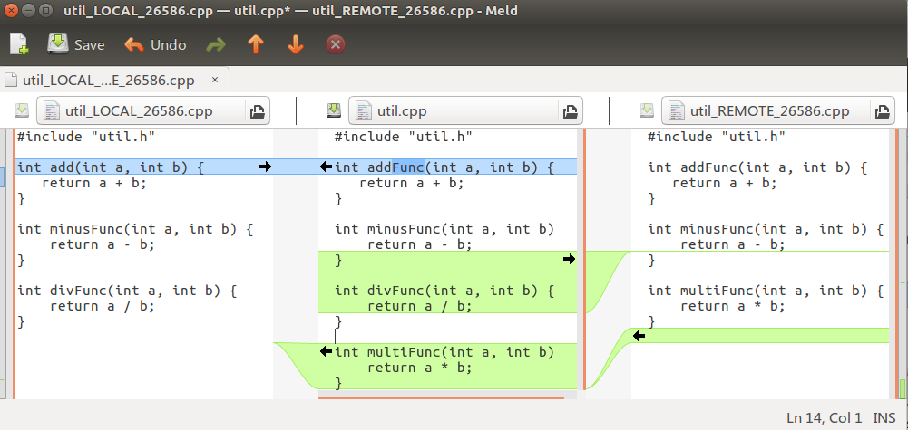
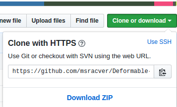
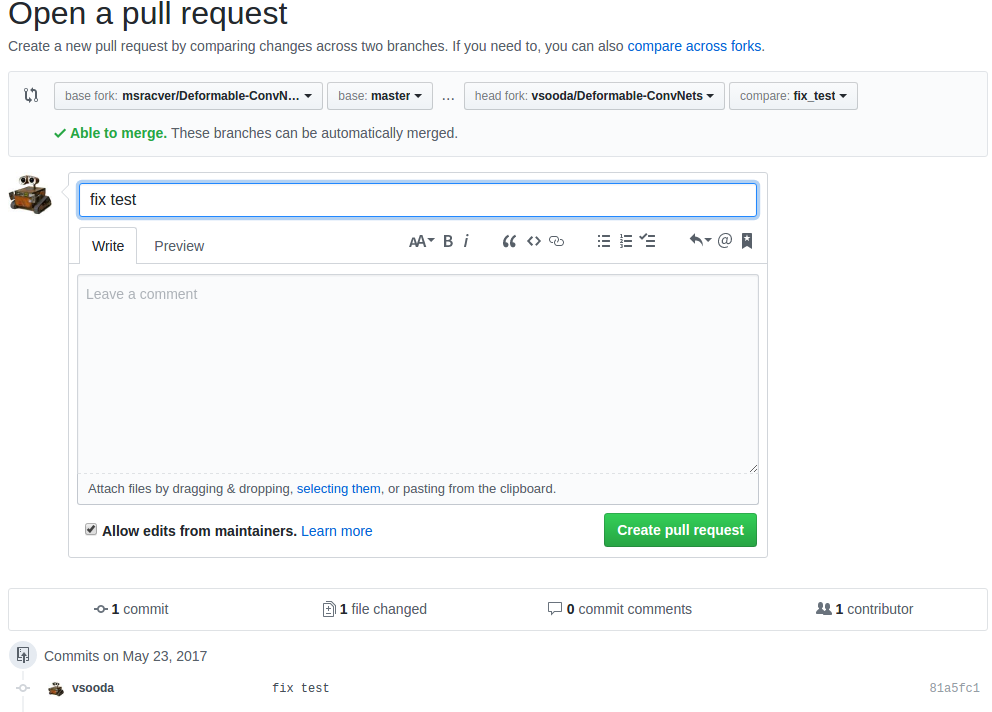

本文介绍git的基本用法。大家心里先有一个问题，github上一个项目几百个人到底应该怎么管理？

## git 基本知识

### git工作流

基本的 Git 工作流程如下：

1. 在工作目录中修改文件。
2. 暂存文件，将文件的快照放入暂存区域。
3. 提交更新，找到暂存区域的文件，将快照永久性存储到 Git 仓库目录。


最常用命令:

```
git add .  //暂存
git commit -m 'xxx'　//提交
git pull　//拉取更新
```


目前位置，这几个操作与svn类似。

每次提交会有一个commit id. 通过git log可以查看提交历史。输出如下。

```
commit 2c29b790d069a46f07cba6a38eb380f4ccbd7635
Author: sooda <liushouda@qq.com>
Date:   Mon May 22 14:47:29 2017 +0800

    fix merge

commit 0f2830daa6ac8dc3b681bbd53a16a58534a55b0d
Merge: 1d7a343 4a906a4
Author: sooda <liushouda@qq.com>
Date:   Mon May 22 14:36:08 2017 +0800

    Merge branch 'master' into div
```


有了这个commid id某次提交的校验码。用前面4,5个字符基本上就可以唯一确定一个提交了。


有了这个id，任何时候都可以回退，查看这次提交的内容。


```
git checkout commid_id 检出某次提交，可以用于简单测试该提交状态下代码有没有问题，也可以从该提交重新切分支
git reset --hard commid_id 重置到某次提交
```


### 远端

git在本地控制实际上就是一个.git文件夹。把这个.git文件夹删掉之后，就跟git没啥关系了。

git是一个分布式版本控制。从任何一个副本都可以恢复整个提交历史。一个本地仓库可以跟踪多个远程仓库，

* 通过git remote add 添加。
* git remote -v 显示远程信息。
* git fetch remote_name来拉取该远端。
* git merge remote_name/branch_name来合并该分支。
* git push remote_name branch_name来推送到某个远端。

默认来说，本地分支是master。默认跟踪的远端是origin。 也就是说本地分支branch_name下操作pull/push等操作都是相对于origin的。


#### gitlab，github

这些只是提供一个远程管理功能。本质上还是git。git服务器可以自己搭建，不一定要gitlab或者github


### 常用命令

git status

git add

git rm

git commit

git push -u origin branch_name

git fetch

git checout -b branch_name <origin/branch_name>

git branch

git show commid_id

git diff

git diff --staged

git remote -v

git log <filename>

git remote add

git remote set-url

git branch -D branch_name


## 实战

### 创建仓库

mkdir git_tutorial

git init

编辑 README

```
this is a simple demo showing how to use git in team work.
```

git add README

git commit -m 'init commit'

这样就完成了第一次提交。

### 开始开发

接下来写一些简单代码

编辑 main.cpp

```cpp
#include <iostream>
using namespace std;

int main() {
    std::cout << "hello git " << std::endl;
    return 0;
}
```

g++ main.cpp -o git_demo

./git_demo

完成hello git了，好棒 :)

提交一下吧。

git add main.cpp

git commit -m 'hello git'


再增加一些功能。

├── main.cpp
├── Makefile
├── README
├── util.cpp
└── util.h


util.h

```cpp
int add(int a, int b);
```

util.cpp

```cpp
#include "util.h"
int add(int a, int b) {
  return a + b;
}
```

main.cpp

```cpp
#include <iostream>
#include "util.h"
using namespace std;

int main() {
    int a = 3, b = 5;
    int c = add(a, b);
    std::cout << a << " + " << b << " = " << add(a, b) << std::endl;
    std::cout << "hello git " << std::endl;
    return 0;
}
```

Makefile

```
git_demo : main.cpp util.cpp
	g++ main.cpp util.cpp -o git_demo
```

PS: 对Makefile不熟悉的不必着急。不一定要用Makefile, 使用Makefile之后，直接make等同于执行g++ main.cpp util.cpp -o git_demo，也可以将源码直接加到vs等IDE中，直接run就好了。下同。后面我们修改的主要是util.h, util.cpp, main.cpp这三个文件。不再特别指明。


make之后执行一下：./git_demo 输出如下：

```
3 + 5 = 8
hello git
```


提交吧。先git status看一下当前目录情况。




正常提交的话，需要一次次git add每个文件。比较繁琐。有没有办法一次add 多个文件呢。

可以add 整个目录，但是这里git_demo是个可执行文件，显然不是我们想要的。可以先add，再把不要的文件reset掉，但是每个提交都会有这个文件，也是很烦的事情。

一劳永逸的方法是，直接ignore这个文件。

编辑 .gitignore

```
git_demo
```

现在再用git status查看，就不会再出现这个文件了。

git add .

把这些文件进行暂存。

可以用git diff --staged查看一下，确保提交的内容没有问题。

git commit -m 'add function'


### 分支

现在加入我们想要开发一个复杂的功能`减法`。我们开一个分支。为什么要开分支？让我们看几种情况再回来考虑。

git checkout -b minus

编写代码..

```cpp
int add(int a, int b);
int minusFunc(int a, int b);
```

```cpp
#include "util.h"

int add(int a, int b) {
   return a + b;
}

int minusFunc(int a, int b) {
    return a - b;
}
```

```cpp
#include <iostream>
#include "util.h"
using namespace std;

int main() {
    int a = 3, b = 5;
    int c = add(a, b);
    std::cout << a << " + " << b << " = " << add(a, b) << std::endl;
    std::cout << a << " - " << b << " = " << minusFunc(a, b) << std::endl;
    std::cout << "hello git " << std::endl;
    return 0;
}
```


git add .

git commit -m 'minus function'

这时候用git branch显示分支有:

```
master
minus
```

现在测试通过，需要将minus合并到master

git checkout master

git merge minus

git log 查看

```
commit 87eaf1e9f2e82aaa5b29e1aaa4e6f736d7b56d7d
Author: sooda <liushouda@qq.com>
Date:   Sun May 21 18:03:47 2017 +0800

    minus function

commit 7956201e1de99b7b371c895b22345e02118d383d
Author: sooda <liushouda@qq.com>
Date:   Sun May 21 17:19:51 2017 +0800

    add function

commit 07460d8b806d8b1e6090785f93e802a490ecdc79
Author: sooda <liushouda@qq.com>
Date:   Sun May 21 16:12:39 2017 +0800

    hello git

commit ce0bae17393d4e0a10b9d2987aef2977c955c186
Author: sooda <liushouda@qq.com>
Date:   Sun May 21 16:12:04 2017 +0800

    init commit
```

现在master提交历史上，就好像只有一个分支一样。


### 远程

#### 创建项目



**添加远程仓库**:

```
git remote add origin git@gitlab.avatarworks.com:shouda/git_tutorial.git
```

提交代码

git push -u origin master


### 协作

#### 开发人员b

现在加入有另一位成员b加入进来，一起开发`multiply`。

```
git clone http://shouda@gitlab.avatarworks.com/shouda/git_tutorial.git
```

git checkout -b multiply

```cpp
int add(int a, int b);
int minusFunc(int a, int b);
int multiFunc(int a, int b);
```

```cpp
#include "util.h"

int add(int a, int b) {
   return a + b;
}

int minusFunc(int a, int b) {
    return a - b;
}

int multiFunc(int a, int b) {
    return a * b;
}
```

```cpp
#include <iostream>
#include "util.h"
using namespace std;

int main() {
    int a = 3, b = 5;
    int c = add(a, b);
    std::cout << a << " + " << b << " = " << add(a, b) << std::endl;
    std::cout << a << " - " << b << " = " << minusFunc(a, b) << std::endl;
    std::cout << a << " * " << b << " = " << multiFunc(a, b) << std::endl;
    std::cout << "hello git " << std::endl;
    return 0;
}
```


git add .

git commit -m 'multiply'

git push -u origin multiply  (没有加-u下次需要加set-upstream,根据提示操作即可)

在gitlab（github）上提交合并请求。




---

#### gitlab merge

项目维护员点击: accept merge request即可合并到master分支

---

#### 开发人员a

用户a在开发`除法`。

git checkout -b ‘div'

编写代码，

```cpp
int add(int a, int b);
int minusFunc(int a, int b);
int divFunc(int a, int b);
```

```cpp
#include "util.h"

int add(int a, int b) {
   return a + b;
}

int minusFunc(int a, int b) {
    return a - b;
}

int divFunc(int a, int b) {
    return a / b;
}
```

```cpp
#include <iostream>
#include "util.h"
using namespace std;

int main() {
    int a = 3, b = 5;
    int c = add(a, b);
    std::cout << a << " + " << b << " = " << add(a, b) << std::endl;
    std::cout << a << " - " << b << " = " << minusFunc(a, b) << std::endl;
    std::cout << a << " / " << b << " = " << divFunc(a, b) << std::endl;
    std::cout << "hello git " << std::endl;
    return 0;
}
```

写到一半(上面给出完整代码，实际上已经可以开始提交了。但在实际中肯定会碰到写一半的情况)，有人说master代码有问题，需要修复一下（通常是有bug，现在假设我们想将add改成addFunc)。这时候怎么办。以前的做法是备份文件夹？？现在肯定不需要。我们有分支！我们只要切回master分支，修改并提交后，再切回这个分支就好了。

说干就干。

**做法一**

git checkout master

git pull

报错

```
error: Your local changes to the following files would be overwritten by merge:
	util.cpp
	util.h
Please, commit your changes or stash them before you can merge.
Aborting
```

意思是，有些文件master的更新修改了util.h, util.cpp, 现在本地同样修改了这个两个文件，需要先把这个修改提交了，否则，无法拉取最新代码。（因为拉取新代码，可能是你本地未提交代码丢失)

##### git stash


**正确做法**：

比较好的做法是将在原div分支上先提交代码，再切换分支。有时候，修改代码比较乱，或者涉及到一些本地环境变量，不想提交。那么，stash （贮存）就派上用场了。贮存的意思就是先把本地的修改存起来，还原一个干净的环境。

git stash

```
Saved working directory and index state WIP on div: 87eaf1e minus function
HEAD is now at 87eaf1e minus function
```

git checkout master

git pull  (切分支最好从最新的master切出来)

git checkout -b 'hotfix'

修改代码。。

```cpp
int addFunc(int a, int b);
int minusFunc(int a, int b);
int multiFunc(int a, int b);
```

```cpp
#include "util.h"

int addFunc(int a, int b) {
   return a + b;
}

int minusFunc(int a, int b) {
    return a - b;
}

int multiFunc(int a, int b) {
    return a * b;
}
```

```cpp
#include <iostream>
#include "util.h"
using namespace std;

int main() {
    int a = 3, b = 5;
    std::cout << a << " + " << b << " = " << addFunc(a, b) << std::endl;
    std::cout << a << " - " << b << " = " << minusFunc(a, b) << std::endl;
    std::cout << a << " * " << b << " = " << multiFunc(a, b) << std::endl;
    std::cout << "hello git " << std::endl;
    return 0;
}
```


git add .

git commit -m 'change add to addFunc'

git push origin hotfix

创建merge request，提交合并请求

现在可以切回div分支继续开发了。

git checkout div

恢复开发环境 git stash pop

这样一切都跟原来一样。git stash不仅仅用于这种合并的时候，任何时候想要还原干净环境都可以这样做。


继续编写代码，测试通过之后commit

git add .

git commit -m 'div function'

#### 合并代码

这时候似乎已经完成开发了。直接到gitlab提交合并请求？

虽然这也可以。但是，理我们从master开分支已经较长时间了，master很有可能已经改变了。我们现在最新的代码是否能够直接合并到master并不确定。所以，我们可以尝试将master合并到本分支，看我们的代码是否有冲突。

更新master代码: git fetch origin master:master

git merge master

ops! 冲突了。。

```
Auto-merging util.h
CONFLICT (content): Merge conflict in util.h
Auto-merging util.cpp
CONFLICT (content): Merge conflict in util.cpp
Auto-merging main.cpp
CONFLICT (content): Merge conflict in main.cpp
Automatic merge failed; fix conflicts and then commit the result.
```


接下来我们学习如何合并冲突。



用文本编辑器打开，util.h

```cpp
int addFunc(int a, int b);
int minusFunc(int a, int b);
<<<<<<< HEAD
int divFunc(int a, int b); //当前分支的代码
=======
int multiFunc(int a, int b); //master分支的代码
>>>>>>> master
```

上面中文注释部分是新加的。这个冲突的意思是，你当前分支希望这一行是divFunc, master分支希望是multiFunc。git不知道到底听哪个好了。所以列出来由我们决定。

从我们业务逻辑出发，这两个都要啊。那就改下这个代码..

```cpp
int addFunc(int a, int b);
int minusFunc(int a, int b);
int divFunc(int a, int b);
int multiFunc(int a, int b);
```

这样就算util.h的冲突解决好了。但是如何让git知道你已经解决好冲突了呢。答案是暂存。 git add util.h即可。

同样的方式解决main.cpp的冲突。


我们再来看一下util.cpp

```cpp
#include "util.h"

int addFunc(int a, int b) {
   return a + b;
}

int minusFunc(int a, int b) {
    return a - b;
}

<<<<<<< HEAD
int divFunc(int a, int b) {
    return a / b;
=======
int multiFunc(int a, int b) {
    return a * b;
>>>>>>> master
}
```

#### mergetool

在这个例子中，手动修改一下很容易。如果更复杂的合并，则可能需要用到mergetool了。我们尝试在这里使用一下mergetool。在ubuntu下我们使用meld

```
sudo apt-get install meld    //安装
git config --global merge.tool meld  //设置为默认mergetool
```

git mergetool

弹出一个界面



左边表示你当前分支(div)的更改。右边表示被合并分支master的更改。中间表示你希望的合并结果。

你可以点击左边绿色的箭头，告诉mergetool说，这个函数是需要的。点击以后的结果是:



现在的情况表明，要么选中间的，要么选右边的。没办法兼容的样子。。

没关系，我们还有一招，中间那个文件是可以直接修改的。我们手动把右边的第三个函数copy到中间来，



这样看起来应该没错了（中间的合并结果比右边多了一个divFunc，比左边多一个multiFunc）。[ps: 注意上面代码没合并有问题,后面会有解决方案].

点击右边addFunc那个箭头。因为我们希望add替换成addFunc的。



按ctrl s保存后，关掉这个图形界面即可。如果有多个文件需要合并，会跳出新的合并页面。

make一下，看看是否编译通过，效果是否正确。正确之后就可以提交了。

git commit

跳出一个合并信息页面。一般不需要更改，直接保存退出就好了。

这样就完成了将master合并到div了

现在可以将div提交合并了。

git push origin div

提交代码之后，回到主分支继续工作


### 参与github项目

#### 下载

假设一个场景，我们发现https://github.com/msracver/Deformable-ConvNets这个项目跟我们相关性很大。我们想把它下下来看看。



一种方法是直接下载源码zip，这个非常不建议的。因为人家项目还会继续更新，而下载源码zip则已经丢失git信息


正确的做法是先fork这个项目。


点击fork这个按钮。会生成在我们自己名下的一个仓库。比如: https://github.com/vsooda/Deformable-ConvNets


找个目录clone这个地址就好了。 git clone https://github.com/vsooda/Deformable-ConvNets


#### 修改

下载下来，跑一跑发现这个项目真的挺牛逼的。但是有一些bug或者我们需要自己定制。

现在以修bug为例。

开个分支 git checkout -b fix_test

在README.md加上一行: just for test  (只是测试，在实际中肯定要提交有效代码)

git add README.md

git commit -m 'fix test'

git push -u origin fix_test

这样在我们github个人仓库下就可以看到我们自己的修改了。


#### 同步upstream

在我们做这个更改的时候，原仓库可能又有一些更改了。我们需要及时更新我们仓库信息。

这就涉及到多个远端问题了。我们增加一个远端，命名为upstream (只是一个名字，其他名字也可以)

git remote add upstream https://github.com/msracver/Deformable-ConvNets.git

显示一下当前远端有哪些：

```
sooda@thinkpad:~/deep/Deformable-ConvNets$ git remote -v
origin	https://github.com/vsooda/Deformable-ConvNets.git (fetch)
origin	https://github.com/vsooda/Deformable-ConvNets.git (push)
upstream	https://github.com/msracver/Deformable-ConvNets.git (fetch)
upstream	https://github.com/msracver/Deformable-ConvNets.git (push)
```

抓取远端: git fetch upstream

切到主分支: git checkout master

合并原仓库更新到master: git merge upstream/master

切到fix_test分支: git checkout fix_test

合并本地master: git merge master

推送到github: git push


#### pull request

现在这个修改只是我们自己能看到。如果我们这个修改确实对整个项目有帮助，我们希望贡献出去，要怎么做呢。

答案是: pull request

在自己的仓库下，选中fix_test分支后，点击new pull request


进入一个新界面:



写一写这个pull request做了什么。点击`create pull request`提交。接下来就是等待作者的审核了。记得及时回复别人的问题。如果对方有什么修改意见，你直接在fix_test分支继续修改，直接推送上去就好了。不需要重新创建pull request。


#### 更规范一些

参考这个[文章](https://github.com/edx/edx-platform/wiki/How-to-Rebase-a-Pull-Request)

git rebase的使用
git rebase -i HEAD~n //合并多个提交
git rebase origin/master

### 总结

#### 为什么要开分支

现在我们来考虑一下为什么要开分支。先考虑如果不开分支会怎么样：

* 在开发一个功能的时候，我们代码甚至编译不通过。如果需要修复一个线上版本的bug, 我们没有办法快速响应。这时候可能需要复制文件夹。
* 在开发一个功能的时候，如果最终这个功能被认定为不可用，那么这个代码放哪里呢？开个文件夹备份一下？
* 在开发一个功能的时候，我们突然发现一个bug。想知道以前的版本有没有。如果不开分支，又要文件夹备份？

开分支可以认为就是文件夹备份。但是比文件夹备份牛逼的地方在于，他还能合并！我们用文件夹来做只能是替换文件。而无法合并不同修改。


#### 使用原则

* 一个分支只干一件事情。

  ​如果多个功能都在一个分支开发。可能相互代码之间会有影响，如果出问题不好查找。如果其中一个功能用不了，整个分支无法合并到主分支。这时候就很麻烦了。

* 鼓励多提交

  在git中，因为有commid id的存在，只要你提交过代码，就不用担心代码会丢失。可以在开发一个小功能之后就提交代码，小步快跑。最后提交的时候可以合并多个小提交。

  一次git提交相当于一个`承诺:这次提交我完成了xxx功能，这次提交应该可以正常执行`。有了这个保证之后，将来代码有问题，很容易就可以从提交历史回溯，看看哪次提交造成的。

* 写好提交信息

  版本控制的目的就是为了方便查看历史。哪天发现你的代码出问题了，一看提交历史发现是某某某改的。提交信息为空，不写理由。这时候你去问他为什么这么改，他估计也忘记了。所以写好提交信息很重要。


* 临时更改不要提交

  对于本地的一些环境变量，文件名路径名这种不要提交。

* 大的二进制文件不要提交

  git无法区分二进制文件中的区别。只能全部替换。二进制文件会使得git急剧变大


### 作业

1. 重现以上实战步骤
2. 在https://github.com/vsooda/git_tutorial.git 上任意开发一个小函数，提交pull request，最后成功被合并。
